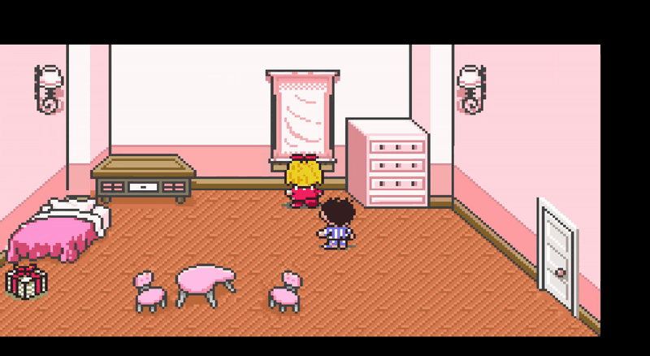
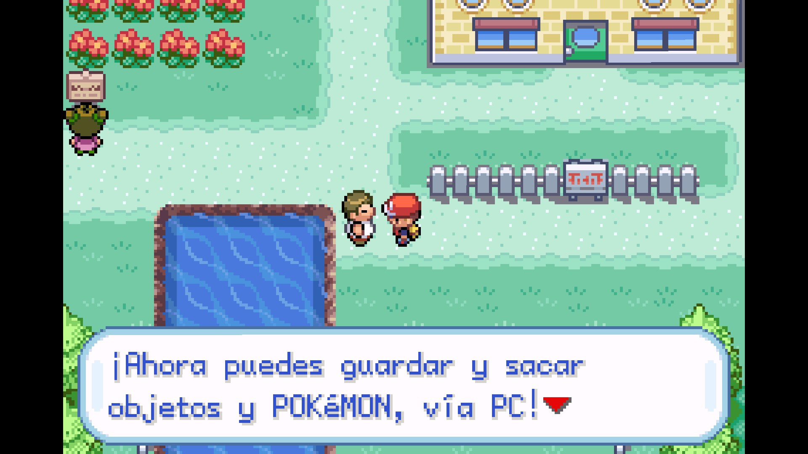
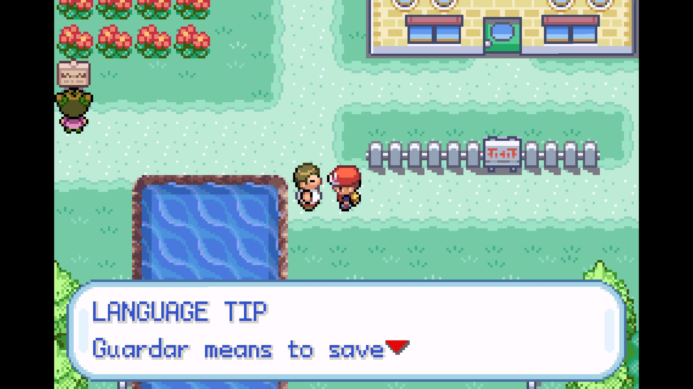

# RomLingo

**Play the game. Learn the language.**

**RomLingo** is an agent-driven framework for turning localized retro games into language-learning experiences.

Open the repository with **Codex**, **Claude Code**, or another repository-aware coding agent, provide your legally obtained game, and let the agent guide setup, inspect the game's text system, build a small playable learning slice, test it, and expand from there.

> **Don't translate the game. Learn through it.**

## See it in action

<p align="center">
  
</p>

RomLingo can preserve the original localized dialogue, then add an English explanation or translation directly into the game's existing text flow. This example uses an EarthBound test project.

### Lessons stay inside the game

The goal is not to turn gameplay into a textbook. RomLingo can add short teaching moments around the dialogue the player is already reading.

**1. Start with the real localized line**

<p align="center">
  
</p>

**2. Add a focused language tip**

<p align="center">
  
</p>

**3. Reinforce it with a memory trick**

<p align="center">
  
</p>

Depending on the project and learner settings, interactions can include:

- line-by-line translation or explanation
- vocabulary and grammar tips
- memory tricks and mnemonics
- short review prompts or quizzes
- lighter explanations as familiar patterns repeat

*The footage and screenshots above are examples from local test projects. RomLingo does not include or distribute commercial game files.*

## Quick start

1. Clone or open this repository with **Codex**, **Claude Code**, or a similar coding agent.
2. Put your legally obtained game file in `input/` when requested.
3. If the game needs an existing fan-translation patch, provide that too.
4. Tell the agent:

   ```text
   Start a new RomLingo project.
   Follow AGENTS.md and guide me through setup one question at a time.
   ```

5. Answer the guided questions.
6. Let the agent analyze the game and create a vertical slice.
7. Playtest the result.
8. Expand only after the pipeline is stable.

See [`START_HERE.md`](START_HERE.md) for the shortest possible setup path.

## Why RomLingo is agent-first

Retro games differ too much in text encoding, compression, pointers, script engines, fonts, control codes, and storage layout for a reliable one-click universal patcher.

RomLingo instead gives a coding agent a repeatable workflow and a place to preserve verified game-specific knowledge. The repository provides:

- persistent agent instructions
- a guided project-setup workflow
- reusable analysis and validation tools
- language-learning design rules
- game-specific project/adapter space
- test and release conventions

A generic tool can reliably do things like hashing files, validating configuration, checking text width, validating structured lesson data, building known adapters, and creating patches once a game's format is understood.

The difficult part is game-specific discovery:

```text
GAME
  -> identify text/script system
  -> extract authentic localized dialogue
  -> understand pointers/control codes/fonts
  -> determine safe expansion/repointing
  -> build a game-specific adapter
  -> validate lessons against real textbox limits
  -> generate and test the patch
```

That is where a repository-aware agent is most useful.

## Agent support

RomLingo is intentionally **agent-agnostic at the workflow level**. Its primary targets are:

- **Codex**
- **Claude Code**
- other similar coding agents that can work directly in a repository, inspect files, run shell/Python tools, edit code, and maintain project context

`AGENTS.md` is the canonical RomLingo instruction set. `CLAUDE.md` is a lightweight Claude Code entry point that directs Claude to the same shared rules rather than duplicating them.

Game-specific knowledge should stay inside each project directory so whichever agent is used can work from the same verified facts.

## Guided setup

The agent should collect only information it cannot infer itself:

- target language
- learner/explanation language
- regional variety preference, when relevant
- the source game
- an existing translation patch or translated base, if needed
- learner level
- teaching intensity
- learning features
- first development milestone
- target emulator/hardware, when relevant
- desired patch format, when technically appropriate

The agent should determine technical details itself whenever possible, including hashes, platform, revision clues, encoding, text storage, pointer formats, control codes, fonts, textbox limits, and expansion strategy.

## Learning model

RomLingo treats the **actual localized text in the game as the linguistic source of truth**.

Do not generate a target-language lesson from another-language script while assuming the localization says the same thing. Localizations often change jokes, idioms, sentence structure, register, terminology, and characterization.

Extract and teach the target localization itself.

For example, original game dialogue might be:

```text
¿Qué estás haciendo?
```

A RomLingo lesson might follow with:

```text
What are you doing?

hacer = to do / make

estás haciendo
= you are doing
```

Later encounters should become shorter as the learner becomes familiar with the pattern.

## Language scope

RomLingo is **language-agnostic**. It does not define support around language families or assume a particular writing system, grammar, word order, or character set.

Actual feasibility depends on the target game: its localization, encoding, fonts, glyph capacity, renderer, script engine, available storage, and how safely those systems can be modified. Some games will be much easier to adapt than others regardless of the language being taught.

**Spanish is used throughout this repository as the primary documentation example.** Spanish examples demonstrate the learning workflow; they are not architectural requirements or a statement about which languages RomLingo supports.

## Vertical-slice rule

New projects should **not** begin by changing thousands of strings.

Start with roughly 5-20 representative interactions covering cases such as:

- short dialogue
- long dialogue
- multi-page dialogue
- variables
- control codes
- special characters
- environmental text
- one grammar lesson
- one review/quiz interaction

Make the whole pipeline work first. Then scale.

## Text safety

A lesson that does not fit is a broken lesson.

RomLingo projects should validate actual rendered width where possible, not just character count. For variable-width fonts:

```text
iiiiiiii
```

may be much narrower than:

```text
WWWWWWWW
```

Overflow should fail the build instead of silently truncating a lesson.

## Repository layout

```text
romlingo/
├── AGENTS.md                  # Canonical shared instructions for coding agents
├── CLAUDE.md                  # Thin Claude Code entry point
├── START_HERE.md              # Human-facing quick start
├── README.md
├── CONTRIBUTING.md
├── LICENSE
├── project_config.example.json
│
├── docs/
│   ├── images/                # README/demo media
│   ├── setup-wizard.md        # Guided onboarding questions
│   ├── agents.md              # Codex, Claude Code, and similar agents
│   ├── agent-playbook.md      # Detailed development rules
│   ├── architecture.md
│   ├── lesson-format.md
│   ├── project-workflow.md
│   └── patching.md
│
├── input/                     # Local source files; ignored by git
├── working/                   # Generated working files
├── builds/                    # Test builds
├── output/                    # Generated project outputs
│
├── tools/                     # Reusable helper scripts
├── language/profiles/         # Optional language profiles; Spanish example + template
├── data/                      # Structured dialogue/lesson data
├── tests/
├── projects/
│   └── template/              # Template for game-specific work
└── release/
```

## Helper tools

The included Python scripts are **support tools for the agent**, not the primary user interface.

For example:

```bash
python tools/romlingo.py analyze input/game.gba
python tools/romlingo.py validate-config project_config.json
pytest
```

As a game-specific pipeline becomes understood, the agent should add reusable extraction, encoding, insertion, build, and test tooling under the relevant project or a shared adapter.

## Project configuration

A game project should eventually contain a configuration file similar to:

```json
{
  "project_name": "example-game-spanish",
  "game": {
    "title": "Example Game",
    "platform": "GBA"
  },
  "language": {
    "target_language": "Spanish",
    "learner_language": "English",
    "target_variant": "Preserve source localization; explain Mexican/Latin American differences"
  },
  "learning": {
    "learner_level": "A2",
    "lesson_density": "balanced"
  }
}
```

## Distribution

RomLingo should distribute original project material such as:

- patch files
- educational lesson data
- source code
- analysis tools
- configuration
- documentation

Do not commit or distribute commercial ROMs, ISOs, BIOS files, or patched commercial game images unless redistribution is explicitly authorized.

Users supply their own legally obtained game files.

## Existing translations

If a project builds on an existing fan translation:

- preserve attribution
- link to the original project when appropriate
- respect its license and distribution requirements
- do not imply ownership of the translation

## Quality rule

When choosing between:

```text
MORE LESSONS
```

and:

```text
FEWER, POLISHED, CORRECT LESSONS
```

choose the second.

Make the pipeline reliable first. Expand afterward.
